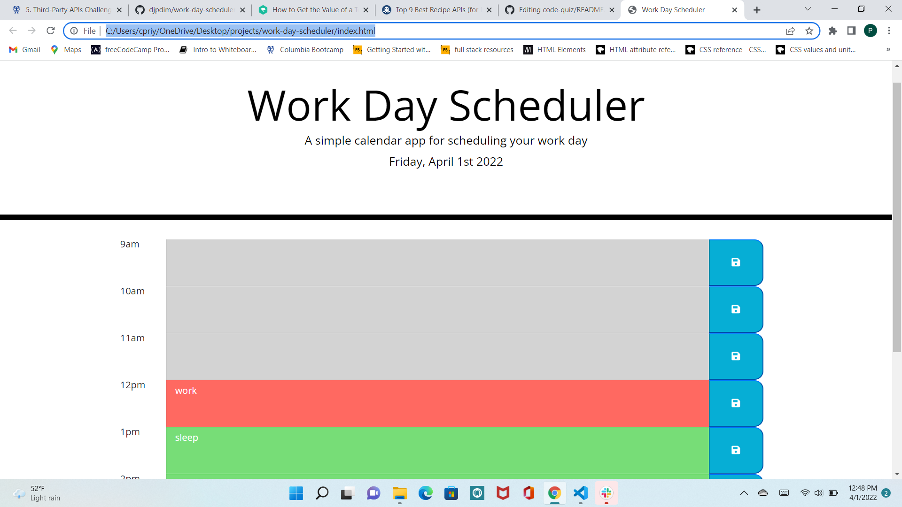

# work-day-scheduler
## Description

The purpose of this application is to create a daily calendar to help stay more organized with daily tasks.

## Applications Used

HTML, CSS, JavaScript, Jquery, Bootstrap. Application was created with the use of a base code which contained the HTML and CSS code files. The following additions were made to the existing code base:
* 8 Time blocks were added to represent a 9am to 5pm schedule.
* Each timeblock contains a textarea for the user to input the task, and a save button to save the daily tasks.
* Moment.js code was built upon to display day and date at the top of the page.
* Script.js file was created to create functions to change the colors of the time blocks based on the current time and to save and retrieve items from localstorage.

## Usage

This application provides a user with 8 time blocks from 9am to 5pm to save their daily tasks. A grey time block refers to a time in the past, red refers to current time, and green refers to a future time. The user can plan their day efficiently using this color-coded sytem. The application also saves the tasks entered by the user to localstorage. The application was completed to meet the criteria outlined below.

## User Story

* AS AN employee with a busy schedule
* I WANT to add important events to a daily planner
* SO THAT I can manage my time effectively

## Acceptance Criteria

* GIVEN I am using a daily planner to create a schedule
* WHEN I open the planner
* THEN the current day is displayed at the top of the calendar
* WHEN I scroll down
* THEN I am presented with time blocks for standard business hours
* WHEN I view the time blocks for that day
* THEN each time block is color-coded to indicate whether it is in the past, present, or future
* WHEN I click into a time block
* THEN I can enter an event
* WHEN I click the save button for that time block
* THEN the text for that event is saved in local storage
* WHEN I refresh the page
* THEN the saved events persist

## Credits

W3 schools tutorials for defining functions, Jquery documentation for understanding parent/attr/val definitions. And tutor Abdullah for thinking about the logic.

## Screenshot

## Link to deployed page

[Coding Quiz]( https://cpriyam90.github.io/code-quiz/)
